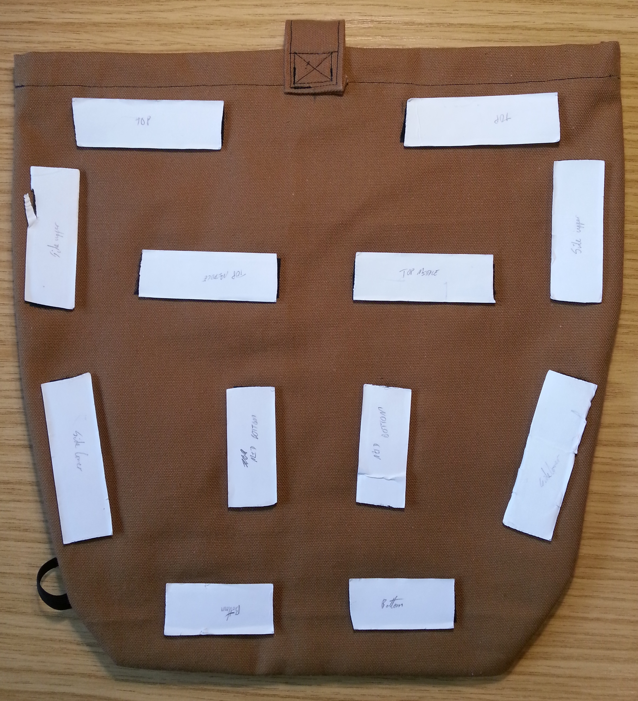
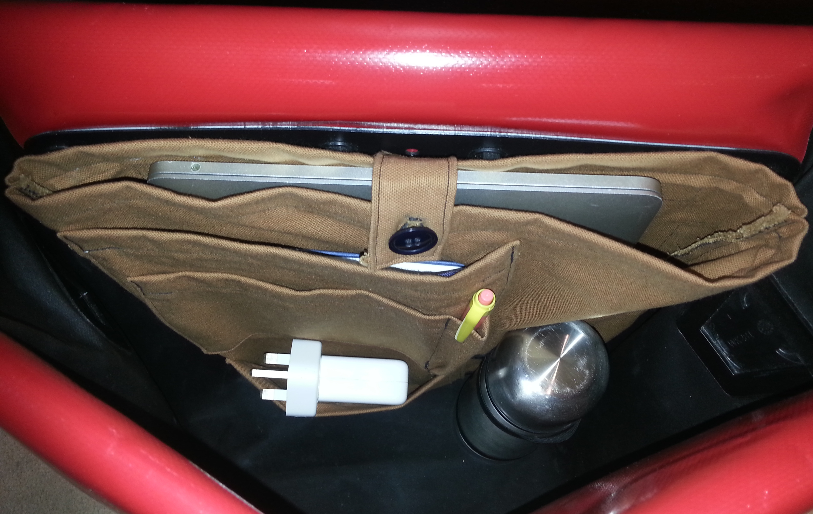

# DIY Ortlieb City Pannier Bag Organiser

My bike pannier bags only have a single large compartment, which means that small items can easily get lost inside them. Ortlieb do sell an organiser insert with smaller pockets and pouches, but it is a bit too expensive for me. This project therefore documents my attempt at making my own organiser for the Ortlieb City bike pannier bags.

## Design

A suitable bag organiser design needs to meet the following requirements:
- Must have a large flat compartment for a laptop or A4 paper
- Must have a selection of small pockets for bits and pieces
- Must not take up excessive space in the bag when not in use
- Must be able to hold a drinks bottle upright
- Must hold in place inside the bag without irreversably modifying the bag
- Must be constructed from inexpensive materials that I have the means to work with

Fabric is well suited for making pockets and bags, and should be more compact than a rigid organiser would be. My panniers have a plastic panel on the inside, to which the hardware that holds the bag onto the bike is attached. As I don't want to damage the bag, I've decided to use velcro to attach the organiser to this back panel.  One side of the velcro will be sewn to the back of the organiser, and the other side stuck to the panel.

To be able to meet my requrements for the items I want to hold, my organiser will be made out of a series of fabric pockets. These will be sewn together onto a large fabric pouch, along with some elastic for holding a bottle. The final design consists of 6 pieces of fabric:

- Two identical large panels together form the base of the organiser: a large pouch pocket that will fit an A4 book or laptop.
- A small strap is attached to the back at the top, which can be used to hold the pouch closed preventing the organiser from sagging open when full.
- A large pocket is sewn onto the front left of this, and is big enough to fit an A5 notepad. The space on the front right is used to fit a couple of elastic straps, suitable for holding a bottle upright in the bag.
- Two small pockets are sewn onto the front of the large pocket, one above the other.  The top pocket has an internal division to form a pen holder.

I initially turned to OpenSCAD to create the pattern pieces for my design, however it turned out that this lacked the functionality for creating a 2D line drawing suitable for use as a sewing pattern. I still wanted to use code for my parametric CAD, so for this project I tried out the scripting capabilities of QCAD.

Each pattern piece is defined as a script, which can be run within QCAD by selecting Misc -> Development -> Run Script or by pressing XC. Unfortunately there seems to be no way to define relative script inclusion paths in QCAD, so each pattern piece has a PROJECT_PATH variable at the top that needs to be defined correctly before the script can be run.  

From the script for each piece, I have generated a DXF file and exported this to a PDF for ease of printing. Some dimensions have been included on the PDF exports, so that they can be measured after printing to check that the scaling is correct.

## Construction

Below are the steps I followed to assemble the bag organiser. These may be obvious to anyone more experienced with sewing, but I'll leave them here anyway in case they are useful.

1. Print out the pattern pieces, making sure not to scale them.
2. Pin the pieces to some fabric, and carefully cut them out. I used a fairly heavy canvas material for durability.
3. Fold over the seam allowance and hem, then tack and sew the hems on the three pocket pieces.
4. Fold over the top seam allowance and hem on the two base panels, tack and sew.
5. Tack and sew the bottom small pocket onto the large pocket.
6. Tack and sew the top small pocket onto the large pocket. Remember to fold in the extra fabric for the pen holder along the bottom seam.
7. Sew the pen holder divider line on the top small pocket.
8. Tack and sew the large pocket onto the outside of one of the base panels.
9. Cut and sew a couple of loops of elastic onto the base panel, next to the pockets, as a bottle holder. I used 10mm x 20mm loops.
10. Cut out sections of sew-on velcro and stick-on velcro, pairing one strip of sew-on with one strip of stick-on. 
11. Sew the sew-on velcro onto the outside of the other base panel.  Make sure to position these so they will avoid the fastners on the back side of the pannier bag when the stick-on side is attached. 
12. Tack and sew the base panels together inside out along the seam allowance, then turn the bag right-side out.
13. Fold the seam allowance of the button strap over, then fold in half along the long axis and sew around the edges.
14. Sew a button hole onto one end of the button loop, then cut the material inside the hole.
15. Sew the button loop onto the back side of the organiser, then sew a button onto the front half so that it lines up with the hole on the loop.
16. Position the organiser inside the pannier bag and stick the other half of the velcro pieces onto the plastic panel inside the bag.

## Result

Assembly was straightforward using a sewing machine, even with my limited level of sewing experience. Some of the pockets are not entirely square, as I failed to account for all of the shifting and stretching of the fabric during sewing. I also originally planned to fit two pen holders, however these ended up needing more fabric that I expected so I could only fit one.

Below are a couple of images of the finished organiser.  The brown fabric may not be the most attractive, but it was free and should be quite hard-wearing.

Front of the organiser:

Back of the organiser:

The white patches here are the back of the stick-on velcro, to be used for attaching the organiser to the pannier bag. Below are a couple of images of the organiser after the velcro has been used to install it into a pannier bag, with and without some items inside it.

Organiser installed in bag:

Organiser installed in bag, with some items stored inside:

The stick on velcro seems reasonably sturdy, so hopefully it will be strong enough to hold up to the rigours of everyday use. Time will tell!
