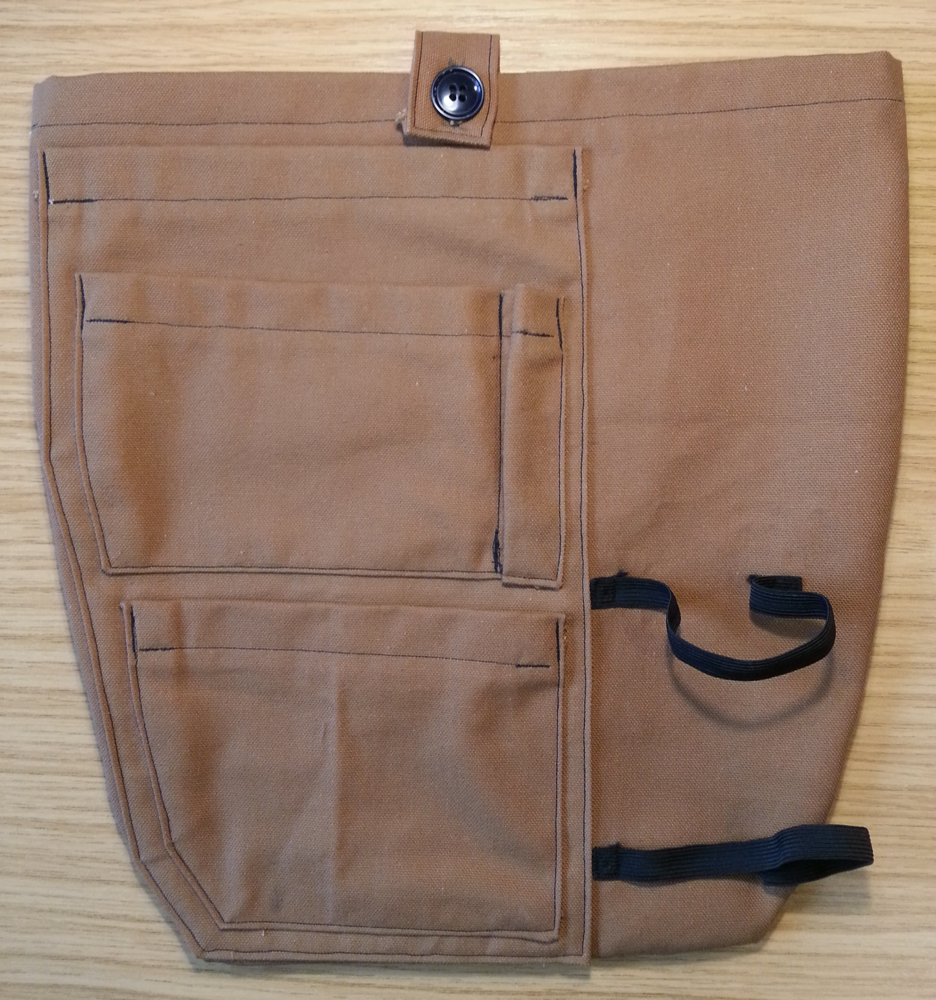
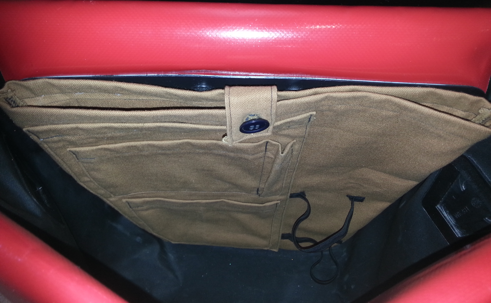

# DIY Ortlieb City Pannier Bag Organiser

This repository contains the design files for a homemade organiser insert for the Ortlieb City bike panniers. The organiser consists of a series of pouches sewn togther using heavy fabric, and is intended to be held inside the pannier using velcro.

More details on the design and construction can be found [here](https://areed.me/posts/2021_03_17_diy_ortlieb_city_pannier_bag_organiser/).

Below are a couple of photos of the completed organiser, to demonstrate the finished product.

